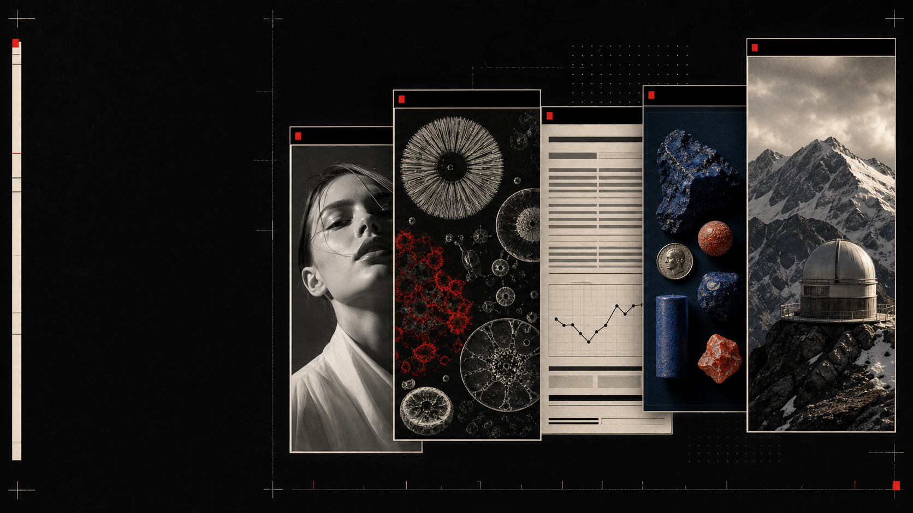
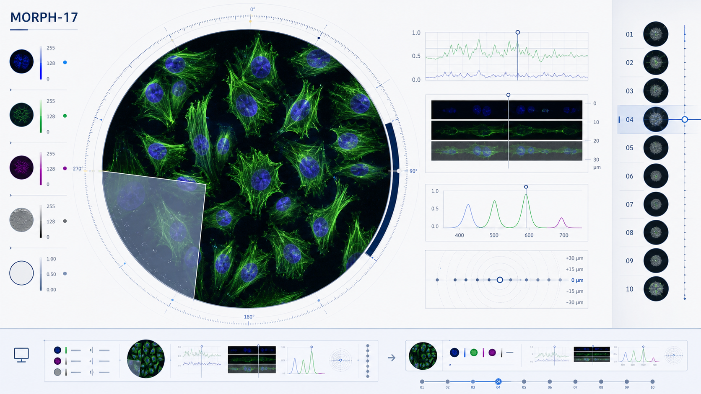
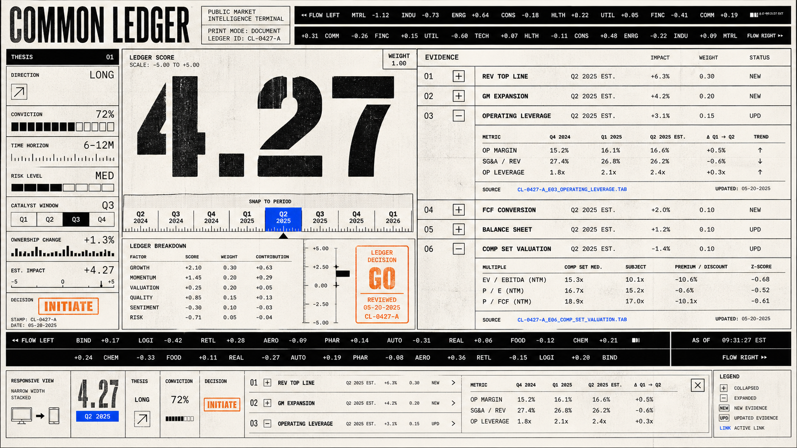
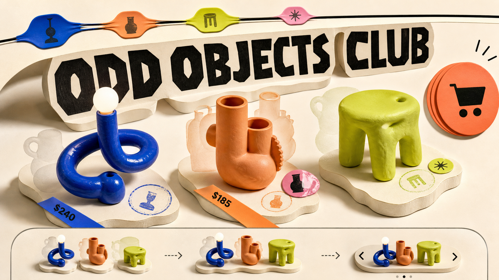
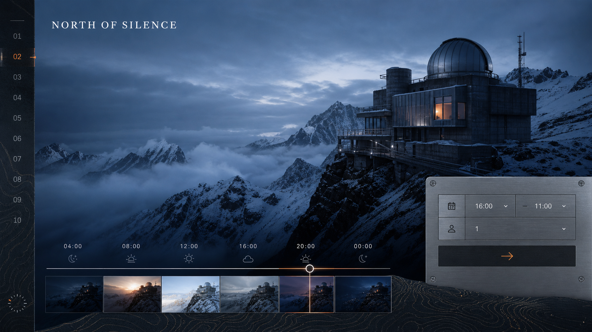

# Awwwards UI

Awwwards UI is an approval-gated creative-director and frontend-builder skill for planning, art-directing, implementing, and validating award-caliber responsive marketing experiences.

[](LICENSE)
[](awwwards-ui/)
[](#how-the-workflow-works)
[](#design-and-production-guarantees)

## What Awwwards UI Is

Awwwards UI turns a website brief into a controlled design-to-production process. It first establishes product truth and presents three evidence-backed creative routes. It implements only after the user explicitly approves one route and authorizes an exact code target.

The skill is built for Codex and compatible agent-skill runtimes. It combines creative direction, responsive systems thinking, production frontend work, and rendered validation in one portable package: [browse the installable `awwwards-ui/` skill](awwwards-ui/).

This is not a component library, a theme collection, or an instruction to decorate every product the same way. Product evidence, audience needs, truthful content, accessibility, and repository conventions determine the result.

## Showcase

The gallery demonstrates the range of art direction the workflow can support. These images are documentation examples, not templates, shipped sites, client work, or award claims. The [image provenance ledger](media/image-provenance.json) records the exact GPT Image 2 prompt for the cover and each selected showcase image.

### Luxury editorial


*Fictional concept artwork generated for documentation: an unbranded luxury editorial direction, not an implemented product or client project.*

### Biotech futurism



*Fictional concept artwork generated for documentation: an unbranded biotech research direction, not an implemented product or scientific claim.*

### Financial brutalism



*Fictional concept artwork generated for documentation: an unbranded financial interface direction, not an implemented product or investment service.*

### Playful commerce



*Fictional concept artwork generated for documentation: an unbranded collectible-commerce direction, not an implemented store or product catalog.*

### Cinematic hospitality



*Fictional concept artwork generated for documentation: an unbranded hospitality direction, not an implemented hotel or booking offer.*

## What It Can Do

Awwwards UI supports a complete creative and production workflow:

- Establish product truth, audience, conversion goals, constraints, content readiness, and risks before choosing a visual language.
- Build a roadmap and present exactly three distinct, evidence-backed routes with calibrated variance, motion, and density.
- Audit existing websites and repositories without writing to them.
- Design and build new responsive marketing sites inside an authorized repository or new target directory.
- Redesign existing experiences while preserving truthful content, behavior, SEO, and user-owned changes.
- Deliver focused pages, sections, components, interactions, and states after approval.
- Create governed brand and generated-asset systems after approval, with continuity, rights, placement, and provenance decisions recorded.
- Validate optical balance, accessibility, responsive behavior, motion, performance, runtime health, and repository-native checks before handoff.

## How the Workflow Works

The approval gate separates design decisions from implementation authority.

| Stage | Purpose | What happens | Write status |
|---|---|---|---|
| **Stage A — Recommend and STOP** | Make the creative decision explicit | Establish product truth, define the roadmap, report companion availability, develop exactly three routes, recommend one, and ask for a route decision | Read-only; no final assets, dependencies, Figma mutation, or application-code changes |
| **Approval** | Lock the direction and scope | The user names a route or approves the single recommended route, then supplies the exact repository or authorized directory and product surface | No implementation until the entry gate is complete |
| **Stage B — Execute in Code** | Realize the approved route | Inspect repository truth, create the approved brand and asset system, implement mobile-first, validate rendered balance, run production checks, and hand off evidence | Writes are limited to the authorized target and scope |

Route approval is mandatory. Words such as “build,” “code,” “implement,” “execute,” “React,” “GSAP,” or “start now” do not bypass Stage A when no route has been approved.

Approval is specific, not implied. “Looks good” in a three-route context, a repository URL by itself, or an undefined hybrid does not unlock Stage B. A material change to the thesis, audience, conversion, page inventory, brand character, asset system, or scope returns the work to approval.

For continuation in another task, paste the approved route record. The skill verifies that product truth is still current and resolves the target and authorized surface; it does not repeat the three-route exercise when the prior decision is adequately documented.

## Execution Modes

The skill chooses the narrowest mode that can complete the approved outcome.

| Mode | Use it for | Output |
|---|---|---|
| **Roadmap** | Planning product truth, scope, information architecture, dependencies, risks, and checkpoints without route development | A read-only implementation roadmap |
| **Recommend** | New sites, full redesigns, and requests to recommend a direction first | A roadmap, exactly three complete creative routes, one evidence-based recommendation, and an approval request |
| **Code Build** | Building a new approved site, page, or experience in an authorized target | A production-oriented responsive implementation of the approved route, plus validation evidence |
| **Code Redesign** | Auditing and transforming an existing repository | A current-state assessment, three routes, an approved Preserve/Recompose/Overhaul transformation, implementation, and validation |
| **Focused Code** | An approved page, section, component, interaction, or state with exact scope | A bounded implementation that preserves the approved route and, for redesigns, its transformation floor |
| **Audit** | A critique that must remain read-only | Findings across brand, hierarchy, balance, mobile behavior, interaction, accessibility, performance, and code quality |
| **Optional Figma Design** | Creating an editable Figma design when the user explicitly requests Figma | An approval-gated editable Figma result within a named file and frame scope |
| **Figma-to-Code** | Implementing a supplied Figma design when explicitly requested | Design inspection followed by repository preflight, code implementation, and normal production validation |

Figma is optional. A Figma URL is context, not route approval, and code workflows never require Figma unless the user chooses a Figma mode.

## Installation

### Skills CLI — recommended

Install directly from the full GitHub repository URL and select the packaged skill:

```powershell
npx skills add https://github.com/calci07/AWWWARDS-UI --skill awwwards-ui
```

The CLI discovers the top-level `awwwards-ui/` package through its recursive fallback and supports Codex as an installation target. Restart or begin a new agent session if the current session does not refresh its skill catalog automatically.

### Manual Codex installation

The source directory is `AWWWARDS-UI/awwwards-ui/`. The destination is `%USERPROFILE%/.codex/skills/awwwards-ui/`, the default personal Codex skill directory on Windows.

```powershell
git clone https://github.com/calci07/AWWWARDS-UI.git .\AWWWARDS-UI
$source = Resolve-Path .\AWWWARDS-UI\awwwards-ui
$destination = Join-Path $env:USERPROFILE '.codex\skills\awwwards-ui'
New-Item -ItemType Directory -Force $destination | Out-Null
Copy-Item -Path "$source\*" -Destination $destination -Recurse -Force
```

When `CODEX_HOME` is configured, use `$env:CODEX_HOME\skills\awwwards-ui` as the destination instead. Use the Skills CLI for upgrades; a manual copy can retain files removed by a later release if the destination is not clean.

### Project-local installation

For a skill available only inside one repository, copy from `AWWWARDS-UI/awwwards-ui/` to `my-project/.agents/skills/awwwards-ui/`. Replace `my-project` with the actual project directory.

```powershell
git clone https://github.com/calci07/AWWWARDS-UI.git .\AWWWARDS-UI
$source = Resolve-Path .\AWWWARDS-UI\awwwards-ui
$destination = '.\my-project\.agents\skills\awwwards-ui'
New-Item -ItemType Directory -Force $destination | Out-Null
Copy-Item -Path "$source\*" -Destination $destination -Recurse -Force
```

Keep the entire directory together. `SKILL.md` depends on the adjacent `agents/`, `data/`, `references/`, `scripts/`, and `tests/` content.

## Quick Start

Invoke the skill by name and describe the product, audience, primary action, required pages, content and asset readiness, constraints, target devices, and available repository context. A concise brief is enough to start; the skill separates known facts, assumptions, and decisions that materially affect the routes.

### New site

```text
Use $awwwards-ui to plan a new marketing site for [product]. The audience is [audience], the primary conversion is [action], and the required pages are [pages]. We have [brand/content/assets] and must meet [constraints]. Create the roadmap and three creative routes, recommend one, and stop for my approval before generating assets or writing code.
```

### Existing-site redesign

```text
Use $awwwards-ui to redesign [site or repository]. Preserve truthful content, working behavior, SEO requirements, and my existing changes. Audit the current experience read-only, then propose exactly three routes with Preserve, Recompose, or Overhaul scope made explicit. Recommend one and stop for approval before editing anything.
```

## Detailed Usage

### Focused hero

An unapproved hero still begins with a compact Stage A and exactly three scoped micro-routes.

```text
Use $awwwards-ui for the hero and its neighboring section on [page]. The primary action is [action], the approved content is [content], and the target is [repository or authorized directory]. Present three focused micro-routes with a geometry and responsive plan, recommend one, and stop for approval. Do not write code or generate the final asset yet.
```

After approval, Focused Code uses the ordinary-hero fast path: lock hierarchy and frame at 390px and 1440px, integrate one approved asset and one motion treatment, review the hero with the next section, and preserve final six-width production QA for the page milestone.

### Read-only audit

```text
Use $awwwards-ui in Audit mode on [URL or repository]. Review brand coherence, hierarchy, optical balance, mobile behavior, interaction, accessibility, performance, and code quality. Remain read-only: report prioritized findings and evidence, but do not edit files, install dependencies, generate assets, or mutate Figma.
```

### Continue an approved route

Use this when the route was approved in another task. Fill every field that applies; omit the three redesign-only fields for a new build.

```text
Use $awwwards-ui to continue this approved route in Stage B.

APPROVED ROUTE
Name: [route name]
Thesis: [locked thesis]
Design variance: [1–10]
Motion intensity: [1–10]
Visual density: [1–10]
Design Read: [one-line design read]
Route invariants: [three to five visible, testable invariants]
Redesign mode: [Preserve, Recompose, or Overhaul — redesign only]
Transformation Map: [approved map — redesign only]
Seven-dimension tally: [approved tally — redesign only]
Primary conversion: [action]
Required pages/routes/states: [inventory]
Brand cues: [locked cues]
Asset families: [approved families]
Signature interaction: [approved behavior]
Known constraints: [constraints]
Approved by user: [approval statement]
Target repository or authorized directory: [exact target]
Authorized product surface: [exact pages, routes, or components]
User-imposed file restrictions: [restrictions or none]
Write policy: [new target or named existing targets]
Locked deliverable inventory: [deliverables]

Verify that the approval remains current, perform read-only repository preflight, derive the concrete file inventory, restate the write gate, then implement and validate the approved scope.
```

### Giving useful approval

Name a route, say “approve the recommended route” when only one route was recommended, or request one revision round. Pair approval with the exact repository or user-authorized new directory and the pages, routes, components, or states that may change.

If you change the audience, conversion, core thesis, page inventory, brand character, asset system, or material scope, ask for revised routes instead of treating the change as an implementation detail.

## Companion Skills and Fallbacks

Awwwards UI resolves companion availability at the relevant stage and reports what is present. It never claims that an unavailable skill or tool ran.

| Companion | Role when available | Bundled fallback when unavailable |
|---|---|---|
| `design-taste-frontend` | Design Read, calibrated dials, design-system mapping, asset floor, layout checks, anti-generic review, and code-facing guidance | Product truth, approved direction, accessibility, optical-balance rules, and the packaged reference system remain authoritative; the gap is disclosed |
| `brandkit` | Brand-system direction after route approval | [`references/brand-and-assets.md`](awwwards-ui/references/brand-and-assets.md) |
| `imagegen-frontend-web` | Approved web-image art direction | [`references/gpt-image-2-art-direction.md`](awwwards-ui/references/gpt-image-2-art-direction.md) and [`references/visual-assets.md`](awwwards-ui/references/visual-assets.md) |
| `imagegen-frontend-mobile` | Approved mobile screen and flow compositions | [`references/mobile-app-web.md`](awwwards-ui/references/mobile-app-web.md) |
| Image-generation access | Production of approved raster asset families | A prompt-and-placement ledger plus honest temporary media only when the user permits it; blocked assets are reported |
| Browser control | Screenshot-based optical-balance and runtime inspection | Available static and local checks, with the rendered-validation gap disclosed and no claim that screenshots were inspected |

Companion defaults never override the brief, approved route, content truth, accessibility, repository architecture, responsive behavior, or performance budget. Their output counts also cannot silently expand scope.

## Project Structure

```text
AWWWARDS-UI/
├── README.md                     # Public onboarding and usage guide
├── CONTRIBUTING.md               # Contribution workflow and review contract
├── LICENSE                       # Awwwards UI MIT license
├── THIRD_PARTY_NOTICES.md        # Upstream license and attribution
├── awwwards-ui/                  # Portable, installable skill
│   ├── SKILL.md                  # Runtime contract and routing rules
│   ├── agents/openai.yaml        # Agent discovery metadata
│   ├── data/                     # Inspiration and provenance datasets
│   ├── references/               # Conditionally loaded production guidance
│   ├── scripts/                  # Package validators and query tools
│   └── tests/                    # Packaged skill contract tests
├── media/                        # Generated documentation artwork and provenance
└── tests/release-contract.test.mjs
```

The root is human-facing. The [portable skill directory](awwwards-ui/) remains self-contained so it can be installed without copying the repository’s public-project documentation.

## Testing and Validation

Run commands from the repository root with a current Node.js release.

### Public release contract

```powershell
node --test tests/release-contract.test.mjs
```

This checks the packaged artifact, documentation structure, media/provenance contract, license, Taste Skill attribution, and public-repository hygiene.

### Packaged skill tests

```powershell
$skillTests = Get-ChildItem .\awwwards-ui\tests\*.test.mjs | ForEach-Object FullName
node --test $skillTests
```

The packaged suite covers validation, inspiration queries, required sources, transformation behavior, and companion-family resolution.

### Package validator and diff hygiene

```powershell
node .\awwwards-ui\scripts\validate-skill.mjs .\awwwards-ui
git diff --check origin/main...HEAD
git diff --check
```

Use the three-dot command to review every committed change on the branch against `origin/main`. The plain command checks only unstaged working-tree changes.

Rendered experience validation is intentionally broader than static tests. Stage B also runs the authorized repository’s native build, type check, lint, unit, integration, and end-to-end checks as applicable, then records exact commands and results.

## Design and Production Guarantees

The skill treats quality as a set of testable responsibilities, not a visual adjective.

### Generated assets

Final asset generation begins only after route approval. Stage B inventories authentic materials, locks a continuity bible, records an asset ledger, preserves verified product geometry and claims, governs responsive crops and copy-safe zones, and rejects synthetic artifacts or unresolved rights. Generated imagery cannot stand in for real customers, facilities, awards, outcomes, product proof, or regulated claims.

### Accessibility

Implementations use semantic structure, keyboard-operable controls, visible focus, logical focus order, touch alternatives, readable contrast and zoom behavior, sensible labels and landmarks, and reduced-motion equivalents. Hover enriches but never unlocks content; inaccessible canvas-only content and interaction traps are hard failures.

### Responsive behavior

Mobile is a deliberate composition, not a scaled desktop. Semantic source order, action priority, touch reachability, crop logic, content density, and navigation are designed for the smaller viewport. Construction reviews use 390px and 1440px; page milestones and final delivery cover 320px, 390px, 768px, 1024px, 1440px, and a wide viewport.

### Motion

Motion must explain hierarchy, state, sequence, material, or spatial relationships. Every behavior defines static, pointer, touch, keyboard, interruption, and reduced-motion outcomes. Expensive perpetual work, scroll capture, focus loss, and decorative movement that delays the primary action are removed.

### Performance

Stage B reserves media dimensions, protects layout stability, uses responsive image policy, limits main-thread and paint cost, cleans up listeners and animation lifecycles, and preserves lightweight poster or static paths. Production review checks loading behavior, route navigation, failed assets, console and network health, hydration, overflow, cumulative layout shift, and avoidable JavaScript.

### Rendered validation

Code shape alone is not proof of design quality. The workflow captures or inspects the rendered experience, checks centered-frame gutter balance, primary anchors, counterweights, section transitions, content stress, interaction states, and breakpoint recomposition, then uses bounded correction passes. Handoff records validated routes, viewports, states, evidence locations, commands, warnings, and skipped checks.

## Boundaries and Limitations

- Awwwards UI does not guarantee an award, commercial result, accessibility certification, legal compliance, or a specific performance score.
- The showcase images are fictional documentation artwork. They are not downloadable templates or functional implementations.
- Stage A does not generate final assets, write application code, install dependencies, or mutate Figma. Route approval and exact target authorization are required for Stage B.
- The skill does not invent product claims, proof, testimonials, clients, metrics, awards, identities, or licensed assets.
- Browser or image-generation gaps are reported honestly. Static checks do not become claimed screenshot review, and prompt ledgers do not become claimed final assets.
- Optional companions improve specialized execution but do not remove the core workflow when absent; named packaged references provide bounded fallbacks.
- Existing repositories keep their architecture, design primitives, package manager, and user changes unless an approved requirement makes a scoped change necessary.
- The project publishes an agent skill and documentation, not a hosted demonstration site, registry package, or editable Figma library.

## Credits

Awwwards UI is created and maintained by Gerald Bitago.

It integrates upstream capabilities from [Taste Skill by Leonxlnx](https://github.com/leonxlnx/taste-skill), pinned at commit [`e988add20dab0fa97d7a76781c48961c8184288e`](https://github.com/leonxlnx/taste-skill/tree/e988add20dab0fa97d7a76781c48961c8184288e). The integrated upstream skills are `design-taste-frontend`, `brandkit`, `imagegen-frontend-web`, and `imagegen-frontend-mobile`.

Awwwards UI orchestrates and extends those capabilities but does not claim upstream authorship. Taste Skill remains under its MIT License. See [Third-Party Notices](THIRD_PARTY_NOTICES.md) for the preserved copyright and license text.

The cover and five showcase mockups are original AI-generated concept artwork created for this project’s documentation. They do not depict real products, clients, awards, or endorsements.

## Contributing

Contributions that improve the skill contract, references, datasets, validators, tests, portability, accessibility guidance, or documentation are welcome. Approval gates, evidence requirements, attribution, and truthful-claim boundaries are release invariants.

Read the [contributor guide](CONTRIBUTING.md) before opening a pull request. It includes the branch workflow, acceptable scope, dataset and generated-media rules, validation commands, and review checklist.

## License

Awwwards UI is released under the [MIT License](LICENSE), Copyright © 2026 Gerald Bitago.

Third-party material remains under its original license and attribution. Review [Third-Party Notices](THIRD_PARTY_NOTICES.md) before redistributing a modified package.
